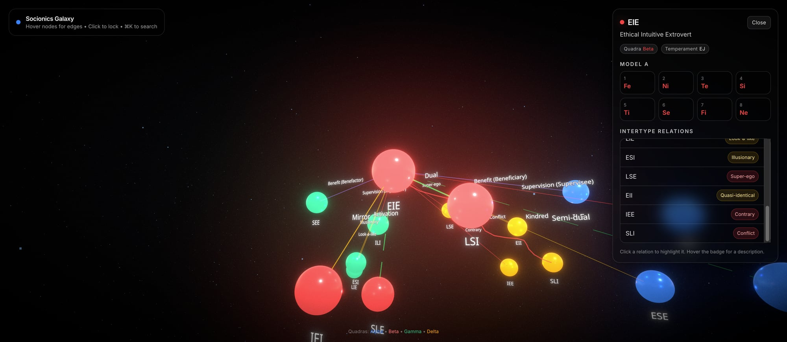

# 🌌 Socionics Galaxy

An interactive 3D visualization of the 16 socionics personality types, rendered as a galaxy of interconnected nodes using React Three Fiber.



## Features

- **16 personality types** as glowing planet nodes, color-coded by quadra (Alpha, Beta, Gamma, Delta)
- **Spiral galaxy layout** with 4 quadra arms and 3D depth
- **All 15 intertype relations** computed from Model A function stacks (not hardcoded)
- **Interactive camera** — click to focus, scroll to zoom, drag to orbit
- **Info panel** with full Model A function stack, quadra, temperament, and all intertype relations
- **Edge highlighting** — click a relation in the panel or on a 3D edge to highlight it bidirectionally
- **Relation tooltips** — hover any relation badge for a description of what it means
- **Search palette** (⌘K) to quickly find any type
- **Particle field** background for that deep-space feel
- **Bloom & postprocessing** for cinematic glow

## How It Works

### Intertype Relations

Relations are computed algorithmically using Model A function positions, not arbitrary lookup tables. For any two types A and B:

1. Find where B's 1st function sits in A's stack → `posOfB1`
2. Find where B's 2nd function sits in A's stack → `posOfB2`
3. Map `(posOfB1, posOfB2)` to one of 16 relation types

This correctly handles all symmetric relations (Duality, Mirror, Activation, etc.) and asymmetric ones (Supervision, Benefit) with proper directionality.

### Layout

Types are arranged in a spiral galaxy formation:
- 4 arms at 90° intervals, one per quadra
- Each type positioned along its quadra's arm with 3D scatter
- Minimum node distance enforced to prevent overlap

## Tech Stack

- [React](https://react.dev) + [TypeScript](https://www.typescriptlang.org) + [Vite](https://vite.dev)
- [React Three Fiber](https://r3f.docs.pmnd.rs) + [Drei](https://drei.docs.pmnd.rs)
- [Postprocessing](https://github.com/pmndrs/postprocessing) (Bloom, Vignette)
- [Framer Motion](https://www.framer.com/motion/) for UI animations
- [Tailwind CSS](https://tailwindcss.com) for styling
- [Zustand](https://zustand.docs.pmnd.rs) for state management
- [cmdk](https://cmdk.paco.me) for the search palette

## Getting Started

```bash
# Install dependencies
npm install

# Start dev server
npm run dev

# Build for production
npm run build
```

## Controls

| Action | Input |
|--------|-------|
| Focus a type | Click on a node |
| Zoom | Scroll wheel |
| Orbit | Left-click drag |
| Search | ⌘K / Ctrl+K |
| Highlight relation | Click relation row or 3D edge |
| Relation info | Hover relation badge |

## Project Structure

```
src/
├── data/
│   └── socionics.ts        # Type definitions, Model A stacks, relation algorithm
├── state/
│   └── useGalaxyStore.ts    # Zustand store (selection, camera, highlights)
├── three/
│   ├── GalaxyScene.tsx      # Main R3F scene orchestrator
│   ├── TypeNode.tsx         # Individual type planet nodes
│   ├── RelationshipEdges.tsx # 3D edge lines between types
│   ├── CameraRig.tsx        # Smooth camera follow + orbit + zoom
│   └── ParticleField.tsx    # Background star particles
├── ui/
│   ├── InfoPanel.tsx        # Side panel with type info & relations
│   ├── SearchPalette.tsx    # ⌘K search overlay
│   └── Hud.tsx              # Top-left title/instructions
├── App.tsx                  # Root component
└── main.tsx                 # Entry point
```

## License

MIT
